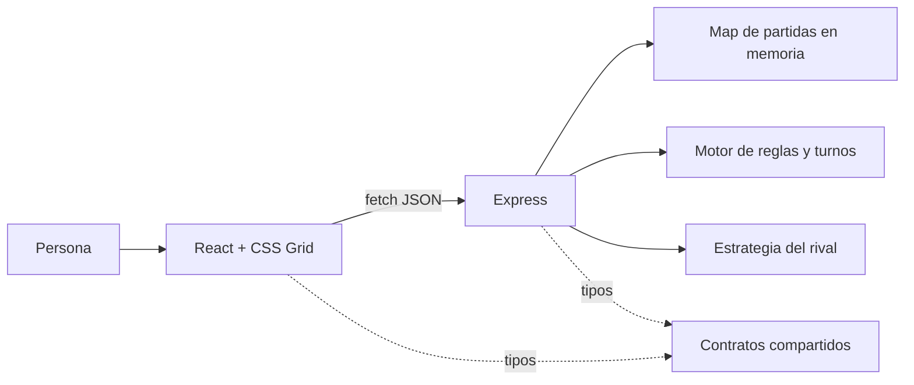

# Mercado de Mareas

Videojuego web por turnos para una persona contra un rival controlado por Express. La persona navega un archipiélago, recoge pescado, especias y perlas, y vuelve a un mercado para venderlas. Las mareas cambian las rutas y los precios durante diez rondas.

**Aplicación publicada:** <https://mercado-de-mareas.onrender.com>

**Repositorio:** <https://github.com/ObitoSage/Mercado-de-mareas>

## Requisitos

- Node.js 24 (`>=24 <25`).
- npm 10 o posterior.
- Google Chrome para `npm run e2e:headed`.
- Chromium de Playwright para `npm run e2e`; se instala con `npx playwright install chromium`.

Comprueba el runtime antes de instalar:

```powershell
node --version
npm --version
```

El primer comando debe mostrar una versión `v24.x`. El proyecto y Render usan Node 24.

## Instalación y desarrollo

Desde la raíz del repositorio:

```powershell
npm ci
npm run dev
```

`npm run dev` levanta Express en `http://localhost:3000` y Vite en <http://localhost:5173>. Vite envía las solicitudes `/api` al backend. Detén ambos procesos con `Ctrl+C`.

## Producción local

```powershell
npm run build
npm start
```

Abre <http://localhost:3000>. Express sirve la SPA compilada y la API desde el mismo origen. El servidor escucha `PORT`; si no existe, usa `3000`:

```powershell
$env:PORT=8080
npm start
```

## Pruebas y calidad

```powershell
npm run lint
npm run typecheck
npm run test
npm run build
npm run e2e
```

La verificación agrupada de lint, tipos, pruebas unitarias/integración y build es:

```powershell
npm run verify
```

Para observar el recorrido E2E en Chrome:

```powershell
npm run e2e:headed
```

Para probar el despliegue publicado con el mismo conjunto:

```powershell
$env:BASE_URL='https://mercado-de-mareas.onrender.com'
npm run e2e:headed
```

Los E2E usan la API Express real. No interceptan ni sustituyen las respuestas del backend.

## Arquitectura



| Ruta | Responsabilidad |
| --- | --- |
| `apps/frontend` | Representa el estado recibido, captura acciones y usa `fetch`. |
| `apps/backend` | Conserva el estado oficial, valida reglas, ejecuta turnos e IA y sirve la aplicación. |
| `packages/shared` | Define contratos serializables y constantes del juego. |
| `tests/e2e` | Recorre inicio, acciones, rechazo y resultado mediante navegador y API reales. |
| `.github/workflows` | Ejecuta lint/tipos, pruebas/E2E y deployment verificado. |

React conserva únicamente estado de interfaz y la copia recibida. Express es la fuente oficial del estado. Las partidas viven en un `Map` en memoria y se pierden cuando el proceso se reinicia.

## API

| Método | Ruta | Resultado principal |
| --- | --- | --- |
| `POST` | `/api/games` | Crea una partida y devuelve `201 { game }`. |
| `GET` | `/api/games/:gameId` | Recupera el estado o devuelve `404`. |
| `POST` | `/api/games/:gameId/actions` | Valida y aplica `MOVE`, `LOAD`, `SELL` o `END_TURN`. |
| `GET` | `/api/health` | Devuelve salud y SHA desplegado. |

La referencia completa, ejemplos verificados y códigos de error están en [docs/api.md](docs/api.md).

## Despliegue

`render.yaml` define un único Web Service Node sin Docker:

- Build: `npm ci && npm run build`.
- Inicio: `npm start`.
- Health check: `/api/health`.
- Auto deploy de Render desactivado; GitHub Actions activa el commit exacto mediante deploy hook.

El repositorio de GitHub necesita estos secretos:

| Secreto | Valor |
| --- | --- |
| `RENDER_DEPLOY_HOOK_URL` | URL privada del deploy hook del servicio. |
| `PUBLIC_APP_URL` | `https://mercado-de-mareas.onrender.com` sin `/` final. |

No guardes el valor del deploy hook en archivos, commits, capturas o documentación pública.

Los workflows independientes son [Lint](https://github.com/ObitoSage/Mercado-de-mareas/actions/workflows/lint.yml), [Tests and E2E](https://github.com/ObitoSage/Mercado-de-mareas/actions/workflows/e2e.yml) y [Deploy](https://github.com/ObitoSage/Mercado-de-mareas/actions/workflows/deploy.yml).

## Documentación

- [Introducción](docs/introduccion.md)
- [Reglas](docs/reglas.md)
- [API REST](docs/api.md)
- [Decisiones técnicas](docs/decisiones.md)
- [Investigación y fuentes](docs/investigacion.md)
- [Uso de IA](docs/uso-ia.md)
- [Video y defensa](docs/defensa.md)

## Matriz de evidencia de 100 puntos

La tabla distribuye diez áreas verificables de la rúbrica aprobada. Sirve para localizar evidencia durante la revisión; la calificación final corresponde al docente.

| Área | Valor | Evidencia concreta | Comprobación |
| --- | ---: | --- | --- |
| 1. Concepto y partida completa | 10 | `docs/introduccion.md`, `docs/reglas.md`, pantalla de inicio y resultado | Jugar las diez rondas y ver el resultado. |
| 2. Interfaz React | 10 | `apps/frontend/src`, tablero CSS Grid y pruebas de componentes | `npm run test -w @mercado/frontend -- --run` |
| 3. Backend Express autoritativo | 10 | `apps/backend/src/domain`, `game-store.ts` y rutas HTTP | `npm run test -w @mercado/backend -- --run` |
| 4. API REST e integración `fetch` | 10 | `docs/api.md`, `game-api.ts`, pruebas Supertest y E2E | Crear, recuperar y modificar una partida por JSON. |
| 5. Reglas, variabilidad e IA | 10 | `rules.ts`, `turns.ts`, `random.ts`, `ai/score.ts` y `strategy.ts` | Suites de reglas, turnos, semilla y estrategia. |
| 6. Calidad y TDD | 10 | 46 pruebas shared, 168 backend, 37 frontend y 4 E2E | `npm run verify` y `npm run e2e` |
| 7. Accesibilidad y respuesta visual | 10 | Roles semánticos, foco, `aria-live`, estado ocupado y movimiento reducido | Pruebas frontend y recorrido manual. |
| 8. CI/CD | 10 | Tres workflows separados y reporte Playwright | Revisar Actions en el repositorio. |
| 9. Publicación | 10 | `render.yaml`, health con SHA y URL pública | Abrir `/api/health` y ejecutar E2E publicado. |
| 10. Documentación y defensa | 10 | README y siete documentos en `docs/` | Seguir `docs/defensa.md` sin pasos implícitos. |

Estado comprobado el 15 de septiembre de 2026: repositorio accesible, aplicación publicada, `/api/health` operativo, juego completo y workflows Lint, Tests and E2E y Deploy verdes para el commit desplegado. El segundo push de entrega queda bajo control del usuario.

## Limitaciones conocidas

- El estado está en memoria: un reinicio o nuevo despliegue elimina las partidas activas.
- El plan gratuito de Render puede entrar en reposo y provocar un arranque en frío.
- No hay cuentas, base de datos, multijugador entre dispositivos ni clasificación global.
- La interfaz se diseñó principalmente para escritorio y portátil; en pantallas estrechas muestra una advertencia no bloqueante.

